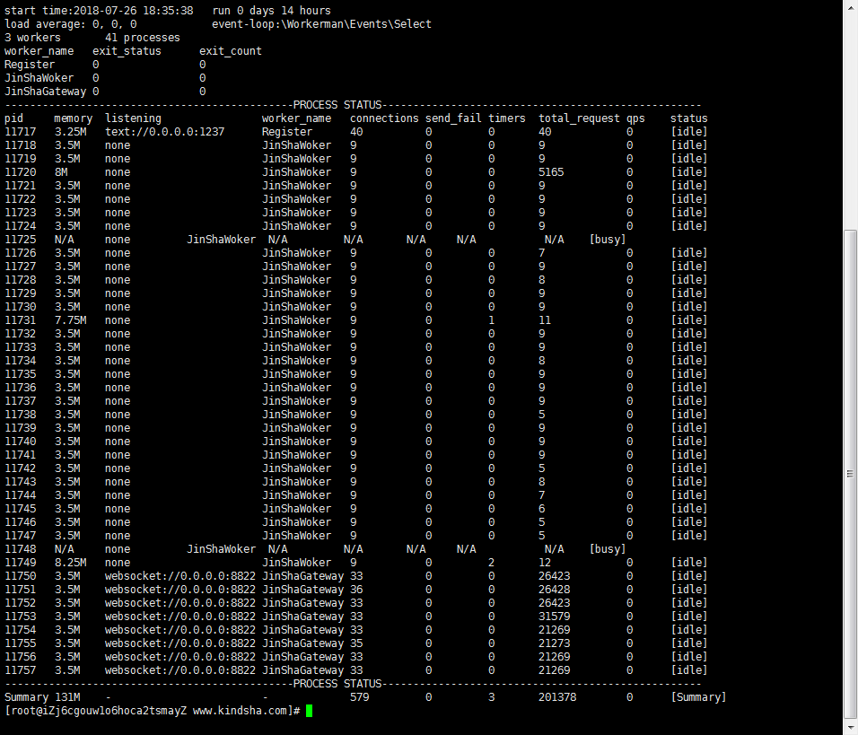

# Debugging von Busy-Prozessen

Manchmal können wir mit dem Befehl ```php start.php status``` feststellen, dass bestimmte Prozesse den Status ```busy``` haben, was bedeutet, dass der entsprechende Prozess gerade eine Aufgabe bearbeitet. In normalen Fällen sollte der Prozess nach Abschluss der Aufgabe wieder in den Zustand ```idle``` zurückkehren, und das sollte in der Regel kein Problem darstellen. Wenn jedoch der Prozess dauerhaft im Zustand ```busy``` verharrt und nicht in den Zustand ```idle``` zurückkehrt, deutet das darauf hin, dass der Prozess durch entweder Blockaden im Geschäftsprozess oder durch eine Endlosschleife eingeschränkt ist. Dies kann durch folgende Methoden diagnostiziert werden.

## Verwendung des strace+lsof-Befehls zur Lokalisierung

**1. Ermitteln der PID des busy-Prozesses im Status**
Führen Sie nach der Ausführung von ```php start.php status``` das Ergebnis auf, wie unten dargestellt:

In der Abbildung befinden sich die ```pid``` der Prozesse im Zustand ```busy``` bei ```11725``` und ```11748```.

**2. Verfolgung des Prozesses mit strace**
Wählen Sie eine PID (hier wird ```11725``` ausgewählt) und führen Sie den Befehl ```strace -ttp 11725``` aus, wie unten dargestellt:

Es ist zu erkennen, dass der Prozess in einer endlosen Schleife von ```poll([{fd=16, events=....``` Systemanrufen verweilt, was darauf hinweist, dass er auf das Lesen von Daten vom Dateideskriptor 16 wartet.

Falls keine Systemanrufe angezeigt werden, bleiben Sie im aktuellen Terminal und öffnen Sie ein neues Terminal. Führen Sie dann den Befehl ```kill -SIGALRM 11725``` (um dem Prozess ein Alarmzeichen zu senden) aus und überprüfen Sie, ob im strace-Terminal eine Reaktion erfolgt oder ob der Prozess bei einem bestimmten Systemaufruf blockiert ist. Wenn keine Systemaufrufe angezeigt werden, deutet dies höchstwahrscheinlich darauf hin, dass das Programm in einer Endlosschleife im Geschäftsprozess steckt. Siehe die Lösung unter Punkt 2 der verschiedenen Gründe für die dauerhafte Busyness des Prozesses am Ende dieser Seite.

Wenn das System bei einem epoll_wait- oder select-Systemaufruf blockiert ist, ist dies ein normaler Zustand und zeigt an, dass der Prozess bereits im Zustand ```idle``` ist.

**3. Anzeigen der Dateideskriptoren des Prozesses mit lsof**
Führen Sie den Befehl ```lsof -nPp 11725``` aus, wie unten dargestellt:

Der Dateideskriptor 16, der in der Zeile mit der Bezeichnung 16u angezeigt wird, entspricht dem Eintrag ```fd=16```. Dieser Eintrag zeigt eine TCP-Verbindung mit der Remote-Adresse ```101.37.136.135:80```. Dies bedeutet, dass der Prozess auf den Zugriff auf eine HTTP-Ressource wartet und die endlose Schleife ```poll([{fd=16, events=....``` erklärt, warum der Prozess den Status ```busy``` hat.

**Lösung:**
Sobald der Blockadepunkt des Prozesses lokalisiert ist, lässt sich das Problem leicht lösen. Zum Beispiel könnte in dem oben genannten Fall die Geschäftslogik beim Aufruf von curl lange keine Daten erhalten, was dazu führt, dass der Prozess aufgrund des Wartens in einer endlosen Schleife stecken bleibt. In einem solchen Fall ist es ratsam, den Anbieter der URL zu kontaktieren, um die Gründe für die verzögerte Rückgabe der URL zu ermitteln. Gleichzeitig sollte beim Aufruf von curl ein Timeout-Parameter hinzugefügt werden, wie z.B. eine Zeitüberschreitung von 2 Sekunden, um längeres Blockieren und Hängenbleiben zu vermeiden (in diesem Fall würde der Prozess möglicherweise für etwa 2 Sekunden im Zustand ```busy``` bleiben).

## Weitere Gründe für die dauerhafte Busyness des Prozesses
Neben Blockaden im Geschäftsprozess oder der Einführung eines Prozesses in den Status ```busy``` gibt es noch andere Gründe, die dazu führen können.

**1. Geschäftsfehler führen zu ununterbrochenem Beenden des Prozesses**
**Erscheinung:** In einem solchen Fall ist die Systemlast möglicherweise ziemlich hoch, und die "load average" in ```status``` liegt bei 1 oder höher. Die Anzahl der ```exit_count``` im Prozess ist hoch und steigt ständig an.
**Lösung:** Führen Sie Workerman im Debug-Modus aus (ohne ```-d```), um mögliche Fehler im Geschäftsprozess zu finden und zu beheben.

**2. Endlose Schleifen im Code**
**Erscheinung:** Im Befehl ```top``` ist zu sehen, dass der busy-Prozess eine hohe CPU-Auslastung aufweist, und im Befehl ```strace -ttp pid``` werden keine Systemaufrufe gedruckt.
**Lösung:** Siehe den Artikel von Laruence, um mithilfe von [gdb und dem PHP-Quellcode die Position der Endlosschleife zu finden](https://www.laruence.com/2011/12/06/2381.html). Die Schritte dazu sind etwa wie folgt:
1. ```php -v```, um die Version anzuzeigen
2. [Laden Sie den entsprechenden PHP-Quellcode herunter](https://www.php.net/releases/)
3. ```gdb --pid=busy-Prozess-PID```
4. ```source Pfad_zum_PHP-Quellcode/.gdbinit```
5. ```zbacktrace```, um den Aufrufstapel zu drucken
Durch den letzten Schritt lässt sich die aktuelle Aufrufliste des PHP-Codes anzeigen, d.h. die Stelle, an der der PHP-Code in einer endlosen Schleife steckt.
Hinweis: Wenn ```zbacktrace``` keine Aufrufstapel druckt, liegt es möglicherweise daran, dass PHP beim Kompilieren keinen ```-g```-Parameter verwendet wurde. In diesem Fall muss PHP neu kompiliert und Workerman anschließend neu gestartet werden, um die Position zu lokalisieren.

**3. Unbegrenztes Hinzufügen von Timern**
Die Geschäftslogik fügt kontinuierlich Timer hinzu, aber löscht sie nicht, was dazu führt, dass die Anzahl der Timer im Prozess kontinuierlich steigt und den Prozess letztendlich dazu bringt, unendlich viele Timer zu betreiben. Ein Beispielcode dafür könnte wie folgt aussehen:
```php
$worker = new Worker;
$worker->onConnect = function($con){
    Timer::add(10, function(){});
};
Worker::runAll();
```
Im obigen Code wird bei jeder Verbindung eines Clients ein Timer hinzugefügt, jedoch gibt es keine Logik im gesamten Geschäftscode, um den Timer zu löschen. Dadurch werden im Laufe der Zeit im Prozess kontinuierlich Timer hinzugefügt, was letztendlich dazu führt, dass der Prozess unendlich viele Timer ausführt und somit im Status ```busy``` verharrt.
Korrekte Codebehandlung:
```php
$worker = new Worker;
$worker->onConnect = function($con){
    $con->timer_id = Timer::add(10, function(){});
};
$worker->onClose = function($con){
    Timer::del($con->timer_id);
};
Worker::runAll();
```
