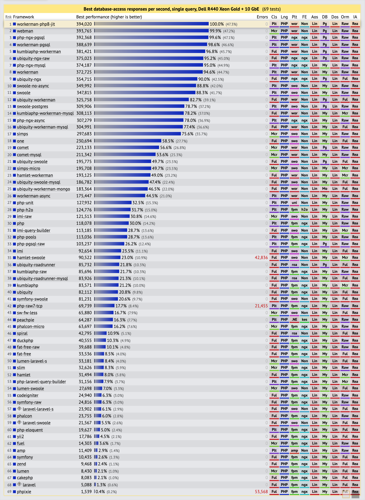

# WorkerMan supports how many concurrent connections

The concept of "concurrency" is too vague, and here we use two quantifiable indicators, "concurrent connection count" and "concurrent request count", to explain.

"Concurrent connection count" refers to the total number of TCP connections maintained by the server at the current moment, regardless of whether there is data communication on these connections. For example, a message push server may maintain millions of device connections, but because there is little data communication on these connections, the server load may be almost zero. As long as there is enough memory, it can continue to accept connections.

"Concurrent request count" is generally measured by QPS (the number of requests processed by the server per second), and the number of TCP connections on the server at the current time is not very relevant. For example, a server has only 10 client connections, with each client connection receiving 10,000 requests per second, so the server needs to be able to support at least 10 * 10,000 = 100,000 requests per second (QPS). Assuming that 100,000 transactions per second is the limit for this server, if each client sends one request per second to the server, the server can support 100,000 clients.

The "concurrent connection count" is limited by the server's memory. Generally, a Workerman server with 24GB of memory can support approximately 1.2 million concurrent connections.

The "concurrent request count" is limited by the server's CPU processing ability. A 24-core Workerman server can achieve a throughput of approximately 450,000 requests per second (QPS), and the actual value varies depending on the complexity of the business and the quality of the code.

## Note

In high-concurrency scenarios, the event extension must be installed, see the installation and configuration section. In addition, Linux kernel optimization is required, especially the process open file limit, please refer to the appendix for kernel tuning.

## Benchmark data
> The data comes from the authoritative benchmarking agency techempower.com's 20th round of benchmarking.
https://www.techempower.com/benchmarks/#section=data-r20&hw=ph&test=db&l=zik073-sf

**Server configuration:**
Total Cores 14, Total Threads 28, 32 GB of memory, Dedicated Cisco 10-gigabit Ethernet switch
**Business logic:**
With business logic involving database queries using PostgreSQL, PHP8+jit
QPS is over 390,000

