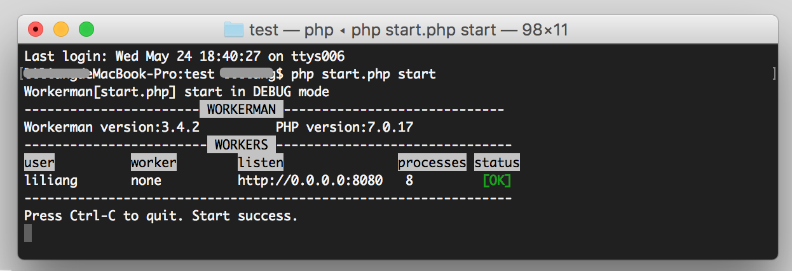

# Several Issues Developers Must Know About workerman

**1. Restrictions in Windows Environment**

A single workerman process in a Windows system can only support 200+ connections.
Multiple processes cannot be set using the count parameter in a Windows system.
Commands like status, stop, reload, restart cannot be used in a Windows system.
Workerman cannot be daemonized in a Windows system, the service stops when the cmd window is closed.
Multiple listening initializations in a single file are not supported in a Windows system.
Linux systems do not have these limitations, and it is recommended to use a Linux system in a production environment, while a Windows system can be used in a development environment.

**2. workerman does not depend on Apache or Nginx**

Workerman itself is a container similar to Apache/Nginx. As long as the [PHP environment is OK](315116), workerman can run.

**3. workerman is command line based**

The startup process is similar to starting Apache using a command (usually not usable in web hosting spaces). The startup interface is similar to the one below:

**4. Long connections must have heartbeats**

It is crucial to add heartbeats to long connections. If long connections remain inactive for extended periods, they may be cleared by the routing node, leading to connection closure.
[Workerman Heartbeat Explanation](faq/heartbeat.md), [GatewayWorker Heartbeat Explanation](https://www.workerman.net/doc/gateway-worker/heartbeat.html)

**5. Corresponding protocols between the client and the server are necessary for communication**

This is a very common issue for developers. For example, if the client is using the WebSocket protocol, the server must also use the WebSocket protocol (`new Worker('websocket://0.0.0.0...')`) to establish connection and communicate. 
Do not attempt to access WebSocket protocol ports in the browser's address bar, or use the WebSocket protocol to access raw TCP protocol ports. The protocols must correspond.
The principle here is similar to using English to communicate with an English speaker or Japanese to communicate with a Japanese speaker. Similarly, in communication protocols, both parties (client and server) must use the same protocol to communicate; otherwise, communication will not be possible.

**6. Possible reasons for connection failures**

When initially using workerman, a common issue is the failure of client connections to the server. The reasons generally include:
1. The server's firewall (including cloud server security groups) blocking the connection (50% probability).
2. Inconsistent protocols used by the client and the server (30% probability).
3. Incorrect IP or port entry (15% probability).
4. The server is not started.

**7. Avoid using exit, die, or sleep statements**

Executing exit or die statements in the business will cause the process to exit and display "WORKER EXIT UNEXPECTED" error. However, the process will immediately restart to continue service. If a return is required instead, it should be called. The sleep statement will put the process to sleep, during which no business will be executed, and the framework will also stop running, resulting in the inability to handle any client requests for that process.

**8. Do not use the pcntl_fork function**

`pcntl_fork` is used to dynamically create new processes. If `pcntl_fork` is used in business code, it may lead to unrecoverable orphan processes, causing business abnormalities. The use of `pcntl_fork` in the business will also affect the handling of events such as connections, messages, connection closures, and timers, leading to unpredictable abnormalities.

**9. Avoid having infinite loops in the business code**

Having infinite loops in the business code will lead to the inability to return control to the workerman framework, resulting in the inability to receive and process messages from other clients.

**10. Code changes require a restart**

Workerman is a framework that resides in memory. Code changes require a restart of workerman to see the effects of the new code.

**11. Long-connection applications are recommended to use the GatewayWorker framework**

Many developers use workerman to develop long-connection applications, such as real-time communication, Internet of Things, etc. For long-connection applications, it is recommended to use the GatewayWorker framework directly. It provides further encapsulation based on workerman, making the development of background services for long-connection applications simpler and more user-friendly.

**12. Support for Higher Concurrency**

If the business requires a concurrency of over 1000 connections simultaneously online, it is necessary to [optimize the Linux kernel](appendices/kernel-optimization.md) and [install the event extension](appendices/install-extension.md).
