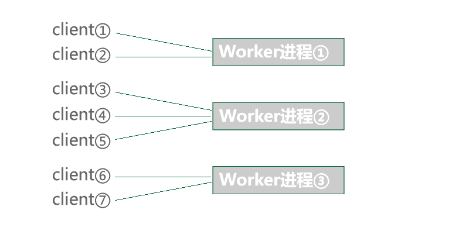

# Principes

### Description du worker
Le Worker est le conteneur de base de Workerman, capable d'ouvrir plusieurs processus pour écouter des ports et communiquer avec un protocole spécifique, similaire à la façon dont nginx écoute un port spécifique. Chaque processus Worker fonctionne de manière indépendante, utilisant Epoll (nécessite une extension event) et des entrées/sorties non bloquantes. Chaque processus Worker peut gérer des dizaines de milliers de connexions clients et traiter les données envoyées sur ces connexions. Le processus principal, pour maintenir la stabilité, se contente de surveiller les processus enfants, sans recevoir de données ou effectuer de logique métier.

### Relation entre le client et les processus Worker

### Relation entre le processus principal et les processus Worker

**Caractéristiques :**

À partir des graphiques, on peut observer que chaque Worker maintient ses propres connexions clients, ce qui facilite la mise en œuvre de la communication en temps réel entre le client et le serveur. Basé sur ce modèle, il est facile d'implémenter des besoins de base en développement, tels qu'un serveur HTTP, un serveur RPC, des données en temps réel provenant de certains appareils intelligents, la diffusion de données côté serveur, des serveurs de jeux, des back-ends pour les mini-programmes WeChat, etc.
