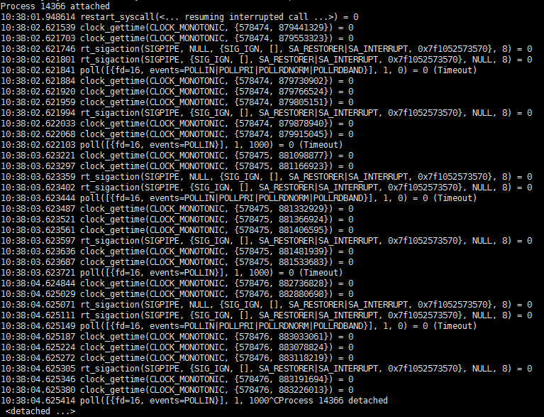

# Debugando processos ocupados
Às vezes, ao executar o comando ```php start.php status```, podemos ver processos em estado ```busy```, o que indica que o respectivo processo está lidando com alguma tarefa. Normalmente, após a conclusão da execução da tarefa, o processo voltará ao estado ```idle```, o que geralmente não apresenta problemas. No entanto, se o processo permanecer constantemente em estado ```busy``` e não retornar ao estado ```idle```, significa que o trabalho dentro do processo está bloqueado ou preso em um loop infinito. Isso pode ser localizado usando os seguintes métodos.

## Utilizando os comandos strace+lsof para localizar

**1. Encontre o PID do processo ocupado no status**
Após executar ```php start.php status```, o resultado exibido será semelhante ao seguinte:

Os processos em estado ```busy``` têm os PIDs ```11725``` e ```11748```.

**2. Rastreie o processo utilizando o strace**
Selecione um PID (por exemplo, ```11725```) e execute ```strace -ttp 11725```, o que resultará em algo similar a isto:

É possível observar que o processo está constantemente realizando a chamada de sistema ```poll([{fd=16, events=....```, que aguarda a ocorrência de um evento de leitura no descritor de arquivo 16. Isso indica que o processo está aguardando dados desse descritor.

Se nenhuma chamada do sistema for exibida, mantenha esse terminal aberto e abra outro terminal. Execute o comando ```kill -SIGALRM 11725``` (enviando um sinal de alarme para o processo) e verifique se há alguma resposta no terminal do strace, ou se ele está bloqueado em alguma chamada de sistema. Se nenhuma chamada do sistema for exibida, isso indica que o programa provavelmente está preso em um loop infinito de negócios. Consulte a seção 2, no final desta página sobre outras razões que podem causar um processo a permanecer ocupado por um longo período de tempo.

Se o sistema estiver bloqueado na chamada do sistema ```epoll_wait``` ou ```select```, isso indica que o processo está em estado ```idle```.

**3. Verifique os descritores de arquivo do processo utilizando o lsof**
Execute ```lsof -nPp 11725```, o resultado será semelhante a isto:

O descritor de arquivo 16 (última linha) corresponde ao registro 16u, e é possível observar que o descritor ```fd=16``` é uma conexão TCP, com o endereço remoto ```101.37.136.135:80```. Isso indica que o processo provavelmente está acessando um recurso HTTP e o loop ```poll([{fd=16, events=....``` está aguardando a resposta do servidor HTTP. Isso explica o motivo do processo estar em estado ```busy```.

**Solução:**
Agora que sabemos onde o processo está bloqueado, é fácil resolver o problema. Por exemplo, com base na localização realizada, é provável que o negócio esteja chamando o curl e que a URL correspondente não esteja retornando os dados a tempo, o que mantém o processo aguardando continuamente. Nesse caso, é possível entrar em contato com o provedor da URL para solucionar a lentidão na resposta, ao mesmo tempo em que devemos adicionar um parâmetro de tempo limite ao chamar o curl, por exemplo, um tempo limite de 2 segundos, para evitar que o processo fique bloqueado indefinidamente (resultando em um estado ```busy``` de cerca de 2 segundos).

## Outras razões que causam um processo a permanecer ocupado por um longo período de tempo
Além do bloqueio do processo ou de outras causas que levam um processo a ficar em estado ```busy```, existem outras razões que podem levar a isso.

**1. Erros fatais nos negócios levando o processo a sair repetidamente**
**Sintoma:** Nesse caso, a carga do sistema será relativamente alta, com o ```load average``` no ```status``` sendo igual a 1 ou mais. O número de ```exit_count``` do processo é alto e continua aumentando.
**Solução:** Execute o Workerman em modo de depuração (execute ```php start.php start``` sem o parâmetro ```-d```) e verifique os erros nos negócios para encontrar e resolver o problema.

**2. Laços infinitos no código**
**Sintoma:** No comando ```top```, podemos ver que o processo ocupado está utilizando uma porcentagem significativa da CPU, e ao executar o comando ```strace -ttp pid```, nenhuma informação sobre chamadas de sistema é exibida.
**Solução:** Consulte o artigo de Chuan Ma sobre [localização utilizando gdb e o código-fonte do PHP](https://www.laruence.com/2011/12/06/2381.html), cujos passos básicos são:
1. Execute ```php -v``` para verificar a versão.
2. [Baixe o código-fonte correspondente à versão do PHP](https://www.php.net/releases/).
3. Execute ```gdb --pid=pid do processo ocupado```.
4. Execute ```source caminho_do_código-fonte_do_PHP/.gdbinit```.
5. Execute ```zbacktrace``` para imprimir a pilha de chamadas.
Com isso, será possível visualizar a pilha de chamadas da execução atual do código PHP, ou seja, a posição do loop infinito do código PHP.
Observação: Se o comando ```zbacktrace``` não imprimir a pilha de chamadas, é possível que o PHP tenha sido compilado sem o parâmetro ```-g```, sendo necessário compilar o PHP novamente e reiniciar o Workerman para localizar o problema.

**3. Adição infinita de timers**
Ao adicionar repetidamente timers no código e não removê-los, isso resultará em um acúmulo de timers dentro do processo, levando-o a executar timers indefinidamente. Um exemplo disso seria:
```php
$worker = new Worker;
$worker->onConnect = function($con){
    Timer::add(10, function(){});
};
Worker::runAll();
```
Nesse código, cada vez que um cliente se conecta, um timer é adicionado, mas não há nenhuma lógica para remover o timer posteriormente. Com o tempo, isso levará a um acúmulo de timers no processo, resultando em um estado ```busy``` indefinido. A correção adequada seria:
```php
$worker = new Worker;
$worker->onConnect = function($con){
    $con->timer_id = Timer::add(10, function(){});
};
$worker->onClose = function($con){
    Timer::del($con->timer_id);
};
Worker::runAll();
```
Dessa forma, o timer é removido quando a conexão é fechada, evitando o acúmulo indefinido de timers no processo.
