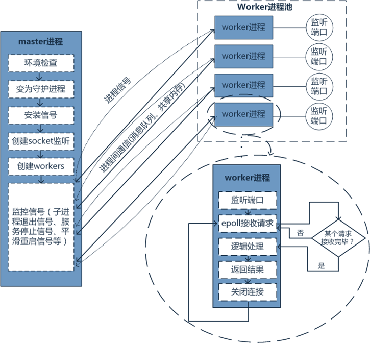

# หลักการ

### การอธิบายเกี่ยวกับ Worker
Worker เป็นคอนเทนเนอร์ขั้นพื้นฐานใน WorkerMan ซึ่งสามารถเปิดพร็อกเซสหลายตัวเพื่อที่จะตรวจจับพอร์ตและใช้โปรโตคอลที่เฉพาะเจาะจงในการสื่อสาร คล้ายกับ nginx ที่ตรวจจับพอร์ตใดพอร์ตหนึ่ง ทุกๆ กระบวนการ Worker ทำงานอิสระกันโดยใช้ Epoll (ต้องติดตั้ง event extension) และการอ่านเขียนที่ไม่บล็อก ทุกกระบวนการ Worker สามารถรับการเชื่อมต่อจากไคลเอนต์ได้หลายหมื่นแล้วจัดการข้อมูลที่ส่งมาจากการเชื่อมต่อเหล่านั้น กระบวนการหลักเพื่อรักษาความมั่นคง เฉพาะในการตรวจจับกระบวนการบุคคล และไม่มีหน้าที่ในการรับข้อมูลหรือการดำเนินการทางธุรกิจใดๆ

### ความสัมพันธ์ระหว่างไคลเอนต์และกระบวนการ Worker

### ความสัมพันธ์ระหว่างกระบวนการหลักและกระบวนการย่อย

**ลักษณะเฉพาะ:** 

จากภาพเราสามารถเห็นได้ว่าแต่ละ Worker รักษาการเชื่อมต่อของไคลเอนต์แต่ละคนเอง สามารถผลัดเปลี่ยนทำให้การสื่อสารแบบ real-time ระหว่างไคลเอนต์และเซิร์ฟเวอร์ได้อย่างสะดวก โดยในพื้นฐานสามารถทำให้เกิดความต้องการพื้นฐานบางอย่างได้อย่างสะดวก เช่น เซิร์ฟเวอร์ HTTP, เซิร์ฟเวอร์ Rpc, การรายงานข้อมูลแบบ real-time จากอุปกรณ์อัจฉริยะ, การโปรยข้อมูลจากเซิร์ฟเวอร์, เซิร์ฟเวอร์เกม, และ backend ของ Weixin mini-program ฯลฯ
