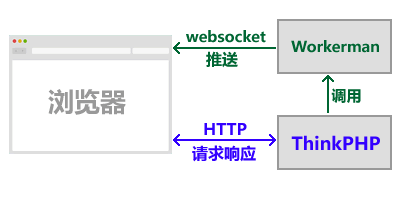

# Diğer çerçevelerle Nasıl Entegre Edilir
**Soru:**

Diğer mvc çerçeveleriyle (thinkPHP, Yii vb.) nasıl entegre edilir?

**Cevap:**

Diğer mvc çerçeveleriyle (örneğin ThinkPHP) entegrasyon önerisi yukarıdaki şekilde yapılmalıdır:

1. ThinkPHP ve Workerman iki bağımsız sistemdir, ayrı ayrı dağıtılır (farklı sunucularda da dağıtılabilir) ve birbirini etkilemez.

2. ThinkPHP, HTTP protokolü ile tarayıcıda sayfa görüntüleme sağlar.

3. ThinkPHP tarafından sağlanan sayfanın js'i websocket bağlantısı başlatır ve Workerman'a bağlanır.

4. Bağlandıktan sonra, hangi kullanıcıya ait olduğunu doğrulamak için Workerman'a bir veri paketi gönderilir (kullanıcı adı, parola veya belirli bir jeton dizesi içerir).

5. Sadece ThinkPHP tarafından tarayıcıya veri gönderilmesi gerektiğinde, Workerman'ın socket arabirimi çağrılır ve veri gönderilir.

6. Diğer istekler hala orijinal ThinkPHP HTTP yöntemiyle işlenir.

**Özet:**

Workerman'ı tarayıcıya veri gönderebilen bir kanal olarak kullanın, yalnızca tarayıcıya veri gönderilmesi gerektiğinde Workerman arabirimi çağrılmalıdır. İş mantığı tamamen ThinkPHP'de gerçekleştirilir.

ThinkPHP'nin Workerman socket arabirimi çağrılması için [Sık Sorulan Sorular - Diğer Projelerde İtinayla](push-in-other-project.md) bölümüne bakın.

**ThinkPHP resmi olarak workerman'ı destekler, [ThinkPHP5 el kitabı](https://www.kancloud.cn/manual/thinkphp5/235128)ne bakın.**
